# Analiza mete i predviđanje mečeva na Valorant e-sport turnirima

**Predmet:** Softverski algoritmi u sistemima automatskog upravljanja
**Autor:** Mateja Stojišić — RA180/2023
**Faza:** VCT Masters London 2026 (jun 2026)

> Napomena: ovo je ažurirana dokumentacija koja odražava trenutno stanje koda
> (`kod/` folder, modularizovan). Originalni `Dokumentacija_projekta.docx`
> je raniji snapshot iz faze prije refaktorisanja i deployment-a — zadržan
> je u repozitorijumu kao istorijski zapis, ali ovaj `.md` fajl je trenutno
> važeći izvor.

## Sadržaj

1. [Uvod i tema projekta](#1-uvod-i-tema-projekta)
2. [Skup podataka](#2-skup-podataka)
3. [Preprocesiranje podataka](#3-preprocesiranje-podataka)
4. [Eksplorativna analiza (EDA)](#4-eksplorativna-analiza-eda)
5. [Feature engineering](#5-feature-engineering)
6. [Priprema dataseta za model](#6-priprema-dataseta-za-model)
7. [Odabir i treniranje modela](#7-odabir-i-treniranje-modela)
8. [Validacija i podešavanje hiperparametara](#8-validacija-i-podešavanje-hiperparametara)
9. [Analiza rezultata predikcije](#9-analiza-rezultata-predikcije)
10. [Odabir najznačajnijih atributa](#10-odabir-najznačajnijih-atributa)
11. [Eksperimenti koji nisu pomogli](#11-eksperimenti-koji-nisu-pomogli)
12. [Deployment modela](#12-deployment-modela)
13. [Simulacija Masters London 2026](#13-simulacija-masters-london-2026)
14. [Analiza mete agenata](#14-analiza-mete-agenata)
15. [Identifikovani problemi i rješenja](#15-identifikovani-problemi-i-rješenja)
16. [Struktura koda](#16-struktura-koda)
17. [Pokretanje projekta](#17-pokretanje-projekta)
18. [Naredne faze projekta](#18-naredne-faze-projekta)
19. [Zaključak](#19-zaključak)

---

## 1. Uvod i tema projekta

Projekat se bavi analizom mete igre i predviđanjem ishoda mečeva na
profesionalnim Valorant e-sport turnirima. Valorant je taktička pucačina
kompanije Riot Games koja od 2020. godine ima razgranat profesionalni sistem
— Valorant Champions Tour (VCT) — sa regionalnim ligama i međunarodnim
turnirima.

Projekat je koncipiran u tri faze:

1. **VCT Masters London 2026** (jun 2026) — predviđanje tokom aktivnog
   turnira. *Ova dokumentacija pokriva ovu fazu.*
2. **VCT Stage 2** regionalna takmičenja (jul–avgust 2026) — predviđanje
   kvalifikacija.
3. **VCT Champions Shanghai 2026** (septembar–oktobar 2026) — predviđanje
   finalnog turnira.

Problem je binarna klasifikacija: za dati par timova (Tim A, Tim B),
predvidjeti da li Tim A pobjeđuje (`team_a_won ∈ {0, 1}`).

---

## 2. Skup podataka

### 2.1 Izvori podataka

| Izvor | Sadržaj | Obim |
|---|---|---|
| Kaggle — VLR.gg Analytics | Mečevi, rezultati, statistike igrač/tim | 4310 mečeva |
| Kaggle — VCT 2021–2025 | Istorijski podaci svih turnira | dio od 4310 |
| Kaggle — VCT 2025 | Detalji sezone 2025 | dio od 4310 |
| Ručno skupljeni — VCT 2026 | Stage 1 standings, Kickoff, Santiago | ~300 mečeva |

### 2.2 Struktura dataset fajlova

Podaci su organizovani u `dataset/2021-2026/vct_{godina}/` sa fajlovima:

- `matches/maps_scores.csv` — rezultati po mapama
- `matches/eco_stats.csv` — ekonomske statistike (pistol, full buy, eco runde)
- `matches/overview.csv` — pregled po igračima (Rating, ACS, ADR)
- `players_stats/players_stats.csv` — detaljne statistike igrača (KAST, HS%, FKPR, clutch)
- `agents/agents_pick_rates.csv` — učestalost biranja agenata
- `agents/teams_picked_agents.csv` — agenti po timu

Dataset (~1.5GB raspakovan) nije dio git repozitorijuma zbog veličine —
distribuira se kao GitHub Release asset (vidi [README.md](README.md)).

### 2.3 Kanonizacija imena timova

Dataset sadrži više različitih zapisa za isti tim, iz dva razloga:

**a) Poznati aliasi** (`config.ALIAS_MAPPING`, ručno kurirano):

```python
ALIAS_MAPPING = {
    "NRG Esports": "NRG",
    "Mega Minors": "NRG",   # NRG-ovi mecevi pod ovim imenom (Champions 2025, Santiago 2026)
    "Rise Gaming": "Rise",
}
```

NRG je u Kaggle datasetu zapisan kao "Mega Minors" za mečeve na Champions
2025 i Masters Santiago 2026. Bez ove kanonizacije, model bi NRG-u dodijelio
samo 9 mečeva iskustva umjesto stvarnih 116 — što je davalo besmislene
predikcije (vidi [§15.1](#151-bug-alias-timova-nrg--mega-minors-u-datasetu)).

**b) Case-insensitive duplikati** (`data_loading.izgradi_case_insensitive_mapping`,
detektovano automatski): imena koja se razlikuju samo po velikim/malim
slovima (npr. `"Aqua"` / `"aqua"`, `"ENVY"` / `"Envy"`) — **34 para**
detektovano u trenutnom datasetu, izvor mapiranja je unija imena iz svih
učitanih CSV fajlova (ne samo glavnog dataseta), jer različiti scraping
izvori različito kapitalizuju ista imena.

---

## 3. Preprocesiranje podataka

- **Nedostajuće vrijednosti**: numerički atributi po timu (ELO, win rate,
  eco statistike...) se popunjavaju medianom kolone, *ne* fiksnom
  vrijednošću poput 0.5 — `tier1_wr`/`recent_int_wr` su izuzetak: timovi
  bez tier-1 iskustva dobijaju 0.3 (signal ispod prosjeka), ne 0.5
  (neutralno), jer "nikad nije igrao protiv top timova" nije neutralna
  informacija.
- **Enkodiranje**: kategorički atributi (`Tournament`, `Stage`, `godina`,
  imena timova) nisu direktno korišteni kao feature-i (one-hot na 100+
  timova i 20+ turnira bi stvorio rijedak, visokodimenzionalan dataset).
  Umjesto toga su **izvedeni** numerički feature-i:
  - `godina` → `recency_weight` (0.30–1.50, vidi [§6](#6-priprema-dataseta-za-model))
  - `Tournament` → `tier1_wr`, `recent_int_wr` (da li je tim igrao na
    međunarodnom turniru)
  - `Team A`/`Team B` → svi team-level feature-i (ELO, dynamic_wr, itd.)
- **Uklonjeni/nekorišteni atributi**: sirovi identifikatori (match ID,
  datum), tekstualni opisi i atributi bez prediktivne vrijednosti za ishod
  meča nisu uvršteni u finalnu listu od 35 feature-a.
- **Ekonomske kategorije** ispravljene — vidi [§15.3](#153-bug-eco-feature-uvijek-05-pogrešni-nazivi-kategorija).

---

## 4. Eksplorativna analiza (EDA)

### 4.1 Korelaciona analiza

Korelaciona matrica svih 35 trening atributa, sa parovima gdje je `|r| > 0.7`
posebno izlistanim u konzoli (**28 jako korelisanih parova** pronađeno, npr.
`diff_acs` ↔ `diff_adr` r=0.895, `diff_pistol` ↔ `diff_eco` r=0.915).

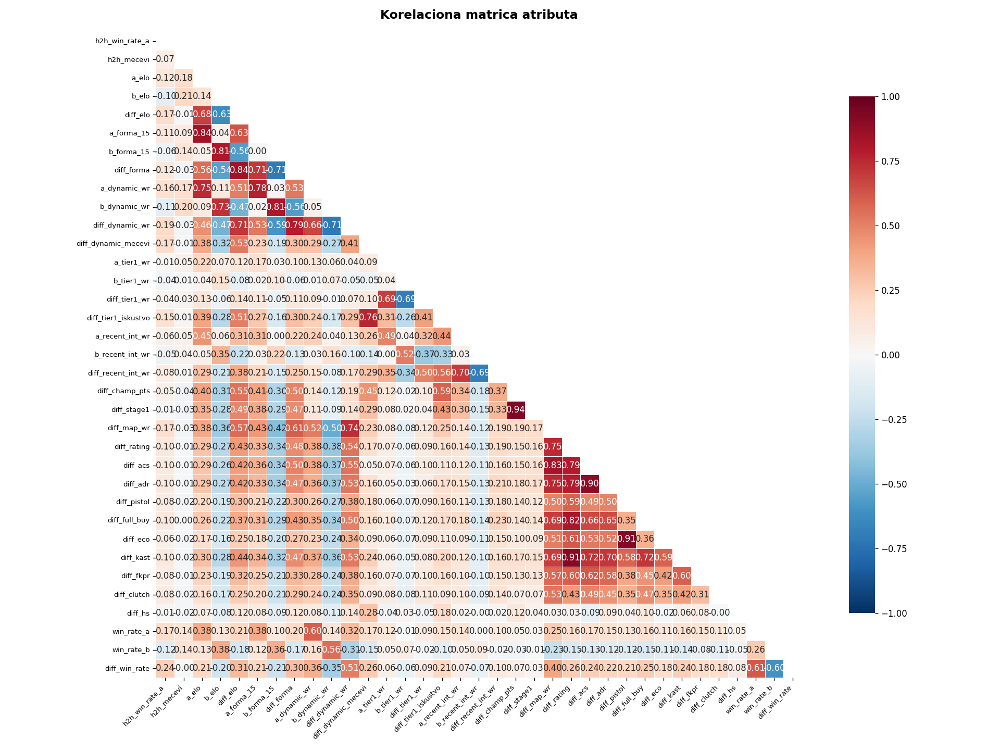

Random Forest i Gradient Boosting su robusni na ovu multikolinearnost
(stabla biraju jedan od korelisanih atributa po splitu, ne pate od
nestabilnosti koeficijenata kao linearni modeli) — ovo je direktno
potvrđeno time da RF/GB konzistentno performuju bolje od Logističke
regresije i SVM-a (vidi [§9](#9-analiza-rezultata-predikcije)).

### 4.2 Detekcija anomalija/ekstremnih vrijednosti

IQR metoda (k=1.5) primijenjena na sve trening atribute. Nekoliko atributa
ima 30–43% "outliera" po IQR-u (npr. `diff_tier1_wr` 42.7%, `diff_champ_pts`
37.3%) — ali ovo su **strukturno rijetki/asimetrični atributi, ne greške u
podacima**: npr. `diff_champ_pts` je 0 za većinu parova jer samo Stage 1
2026 učesnici imaju championship points, pa IQR oko uske mediane "0" flaguje
sve nenulte vrijednosti.

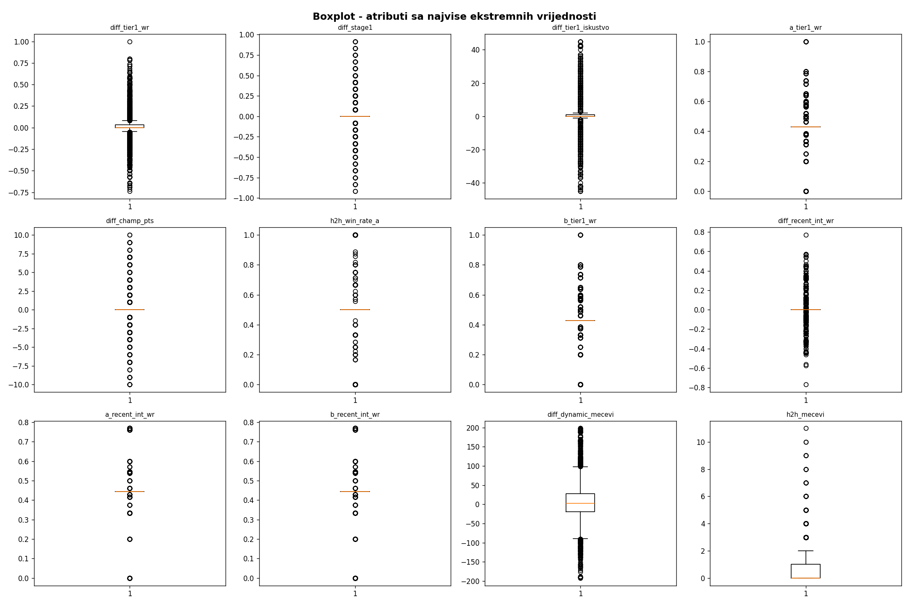

Ova analiza je *report-only* — outlieri se ne uklanjaju automatski, jer su
za ovaj problem ekstremne vrijednosti (npr. tim sa ELO 1860) često stvaran
signal (dominantan tim), ne greška.

---

## 5. Feature engineering

Atributi su podijeljeni u sedam kategorija (implementirano u `kod/features.py`):

### 5.1 Istorijski win rate i iskustvo (dinamički)

Win rate se računa **dinamički** iz dataseta, nakon spajanja aliasa — ovo je
ključno jer predračunati `win_rate` u izvornom CSV-u ne uzima u obzir alias
merge (vidi [§15.2](#152-bug-win_rateab-u-csv-u-računat-prije-kanonizacije)).

- `dynamic_wr` — ukupan win rate tima (Team A + Team B strana)
- `dynamic_mecevi` — ukupan broj odigranih mečeva
- `h2h_win_rate_a` — direktan međusobni učinak (head-to-head)
- `h2h_mecevi` — broj međusobnih mečeva

### 5.2 ELO rejting sistem

ELO mjeri relativnu jačinu tima — za razliku od običnog win rate-a, uzima u
obzir kvalitet protivnika (pobjeda nad jakim timom vrijedi više).

- `elo` — ELO rejting računat hronološki kroz sve mečeve (start: 1500)
- `forma_15` — win rate u zadnjih 15 mečeva (aktuelna forma)
- K faktor: 48 za Champions/Masters (međunarodni), 32 za regionalne turnire

Primjer efekta: NRG (pobjednik Champions 2025) ima visok ELO jer je
pobijedio FNATIC, DRX, Gen.G na svjetskom turniru; Xi Lai Gaming ima niži
ELO jer su mu pobjede uglavnom protiv slabijih kineskih timova.

### 5.3 Tier-1 međunarodni uspjeh

Tier-1 = Champions + Masters serija (jedini turniri gdje se mjere svi
regioni): `tier1_wr`, `tier1_meceva`, `recent_int_wr` (2025–2026 forma na
top sceni).

### 5.4 VCT Stage 1 2026 podaci

`championship_points`, `stage1_score` (normalizovan plasman: 1. mjesto=1.0,
12. mjesto=0.0) — direktno odražavaju formu timova neposredno pred London.

### 5.5 Map win rate

`map_wr` — ukupan win rate po mapama.

### 5.6 Player/team statistike

`rating_avg`, `acs_avg`, `adr_avg` (iz `overview.csv`), `kast_avg`,
`hs_avg`, `fkpr_avg`, `clutch_avg` (iz `players_stats.csv`).

### 5.7 Ekonomske statistike

`pistol_wr`, `full_buy_wr`, `eco_wr`, `semi_buy_wr` (iz `eco_stats.csv`) —
indikatori fundamenta igre i meta-pristupa timova.

---

## 6. Priprema dataseta za model

### 6.1 Train/test split — hronološki, ne random

```python
TRAIN_GODINE = ["vct_2021", "vct_2022", "vct_2023", "vct_2024"]  # 3504 meceva
TEST_GODINE = ["vct_2025", "vct_2026"]                            # 806 meceva
```

Split je namjerno hronološki (~81% / ~19%), ne nasumičan — pošto su mečevi
vremenski uređeni, random split bi mogao "vidjeti budućnost" (trenirati na
meču iz 2025. da bi predvidio meč iz 2021. istog tima), što ne odražava
stvarnu upotrebu (predikcija budućih mečeva na osnovu prošlih).

### 6.2 Recency weighting

Noviji mečevi imaju veću težinu pri treningu (`sample_weight`):

| Sezona | Težina |
|---|---|
| vct_2021 | 0.30 |
| vct_2022 | 0.50 |
| vct_2023 | 0.70 |
| vct_2024 | 0.90 |
| vct_2025 | 1.20 |
| vct_2026 | 1.50 |

### 6.3 Diff-feature

Za svaki par (`feature_a`, `feature_b`) računa se razlika (A − B), npr.
`diff_elo = a_elo - b_elo`. Ovo omogućuje modelu da direktno vidi prednost
jednog tima nad drugim — empirijski jači signal od zasebnih vrijednosti
(`diff_dynamic_wr` je #1 po F-score i RF importance, vidi [§10](#10-odabir-najznačajnijih-atributa)).

Finalna lista ima **35 atributa** (kombinacija individualnih i diff
vrijednosti).

---

## 7. Odabir i treniranje modela

Implementirano je pet klasifikacionih algoritama plus soft-voting ensemble
(`kod/models.py`):

| Algoritam | Skaliranje | Loss funkcija | Regularizacija |
|---|---|---|---|
| Logistička regresija | DA (StandardScaler) | Log-loss (binarna cross-entropy) | L1/L2 penalty, `C` |
| KNN | DA | — (instance-based, glasanje) | `n_neighbors`, `weights`, metrika |
| Random Forest | NE (nepotrebno za stabla) | Gini impurity po splitu | `max_depth`, `min_samples_split/leaf`, `n_estimators` |
| SVM (RBF) | DA | Hinge loss (L2-regularizovan) | `C`, `gamma` |
| Gradient Boosting | NE | `log_loss` (binomijalna devijansa) | `learning_rate`, `max_depth`, rano zaustavljanje |

Skaliranje se primjenjuje selektivno: distance/margin/gradient-osjetljivi
modeli (LR, KNN, SVM) prolaze kroz `StandardScaler` u `Pipeline`-u; stabla
(RF, GB) ne — njihovi splitovi su invarijantni na monotono skaliranje.

Svi modeli (gdje je podržano) primaju `sample_weight` iz recency
weighting-a pri treningu.

---

## 8. Validacija i podešavanje hiperparametara

### 8.1 TimeSeriesSplit umjesto k-fold-a

I cross-validacija i `GridSearchCV` koriste `TimeSeriesSplit` (5 "expanding
window" prozora), ne obični k-fold. Razlog: mečevi su vremenski uređeni
(trening 2021–2024) — obični k-fold može trenirati na kasnijim a validirati
na ranijim mečevima unutar tog perioda, što daje blago optimističnu
procjenu u odnosu na stvarnu upotrebu (predikcija budućnosti iz prošlosti).

### 8.2 GridSearchCV scoring = neg_brier_score, ne accuracy

Hiperparametri se biraju po **kalibraciji vjerovatnoća** (Brier score), ne
po accuracy-ju, jer se `predict_proba()` direktno koristi u Monte Carlo
simulaciji turnira ([§13](#13-simulacija-masters-london-2026)) — model koji
"pogađa pobjednika" ali daje loše kalibrisane vjerovatnoće bi pokvario
simulaciju iako izgleda dobro po accuracy-ju.

### 8.3 Pretraženi grid-ovi

- **Logistička regresija**: `C ∈ {0.01, 0.1, 1, 10, 100}`, `penalty ∈ {l1, l2}`, solver `liblinear`
- **Random Forest**: `n_estimators ∈ {100,200,300}`, `max_depth ∈ {5,8,10,15,None}`, `min_samples_split ∈ {2,5,10}`, `min_samples_leaf ∈ {1,2,4}`
- **Gradient Boosting**: `n_estimators ∈ {100,200,300,500}`, `max_depth ∈ {3,4,5,6}`, `learning_rate ∈ {0.01,0.05,0.1}`, plus rano zaustavljanje (`n_iter_no_change=10`) da nizak learning rate ne bude vještački ograničen brojem stabala
- **SVM (RBF)**: `C ∈ {0.1,1,10,100}`, `gamma ∈ {scale, auto, 0.01, 0.1}`
- **KNN**: `n_neighbors ∈ {3,5,7,9,11,15}`, `weights ∈ {uniform, distance}`, `metric ∈ {euclidean, manhattan}`

### 8.4 Izbor finalnog modela

Finalni deployed model se bira poređenjem najboljeg Brier score-a između
default i tuned modela (ne accuracy-ja — konzistentno sa §8.2). U trenutnoj
verziji datasetа: **Random Forest (tuned)** pobjeđuje (Brier 0.218) nad
default SVM-om (Brier 0.228), iako je SVM imao nešto bolju "sirovu"
accuracy — vidi [§9.2](#92-zašto-rf-a-ne-svm-kalibracija) za detalje.

---

## 9. Analiza rezultata predikcije

### 9.1 Metrike na test setu (vct_2025 + vct_2026, 806 mečeva)

Finalni model: **Random Forest (tuned)** —
`max_depth=5, min_samples_leaf=4, min_samples_split=2, n_estimators=300`

| Metrika | Vrijednost |
|---|---|
| Accuracy | 0.641 |
| ROC-AUC | 0.705 |
| Brier score (niže = bolje) | 0.218 |

```
              precision    recall  f1-score   support
  Team B won       0.63      0.59      0.61       381
  Team A won       0.65      0.69      0.67       425
    accuracy                           0.64       806
```

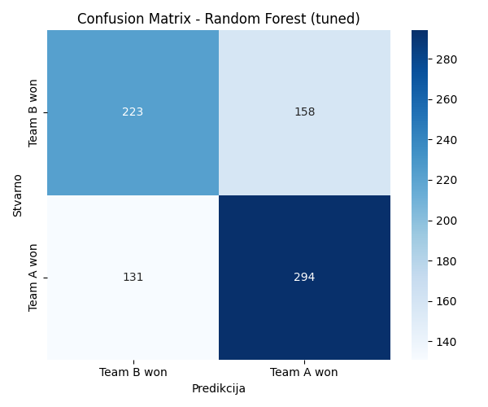

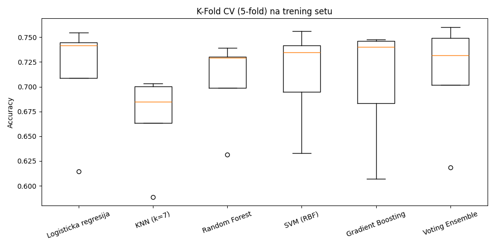

Accuracy ~64% je realan rezultat za predviđanje sportskih ishoda — u
literaturi se za slične probleme obično postiže 60–70%, statistički
značajno bolje od slučajnog pogađanja (50%) ali daleko od determinizma, što
odražava stvarnu nepredvidivost e-sport mečeva.

### 9.2 Zašto RF, a ne SVM? (kalibracija)

SVM (RBF) ima neznatno bolju "sirovu" accuracy u nekim run-ovima, ali
kalibraciona kriva pokazuje sistematsku grešku (S-oblik): na niskim
predviđenim vjerovatnoćama model je potcijenjen (stvarni win rate je viši
nego predviđeni), na visokim precijenjen:

| Predviđeno | Stvarno | Razlika |
|---|---|---|
| 0.144 | 0.210 | +0.066 (potcijenjen) |
| 0.225 | 0.333 | +0.108 (potcijenjen) |
| 0.748 | 0.654 | −0.093 (precijenjen) |
| 0.873 | 0.728 | −0.145 (precijenjen) |

Ovo direktno utiče na Monte Carlo simulaciju jer ona doslovno baca
ponderisanu monetu po tim vjerovatnoćama (`random.random() < p_a`) —
precijenjeni favoriti bi pobjeđivali češće u simulaciji nego što stvarnost
sugeriše. Random Forest ima bolju kalibraciju (Brier 0.218 vs SVM 0.228),
pa je odabran kao finalni model.

---

## 10. Odabir najznačajnijih atributa

Tri nezavisne metode za rangiranje atributa (`kod/feature_selection.py`):

1. **SelectKBest** (ANOVA F-test) — statistička značajnost svakog atributa pojedinačno
2. **RFE** (Recursive Feature Elimination, sa Logističkom regresijom) — top 10 odabranih
3. **Random Forest feature importance** — koliko svaki atribut doprinosi smanjenju nečistoće u stablima

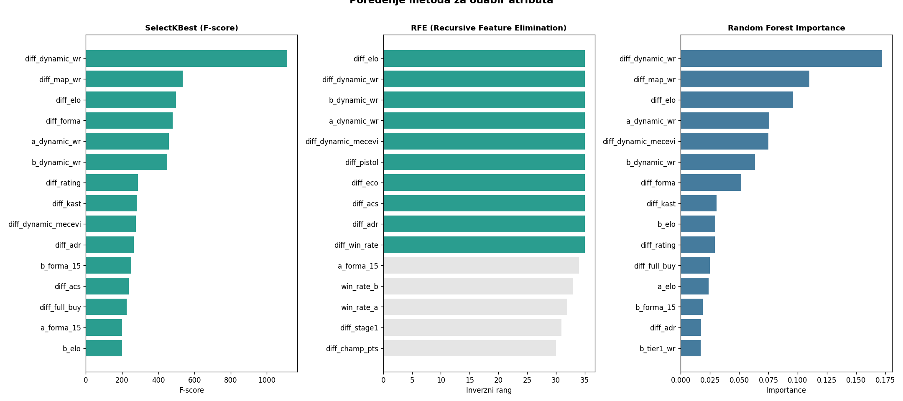

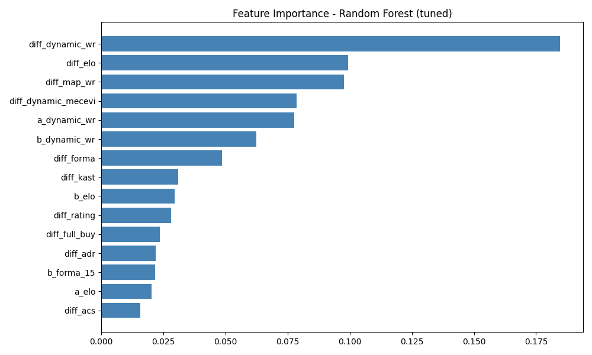

**Top 10 atributa po RF importance** (trenutni model):

| # | Atribut | Importance |
|---|---|---|
| 1 | `diff_dynamic_wr` | 0.185 |
| 2 | `diff_elo` | 0.099 |
| 3 | `diff_map_wr` | 0.098 |
| 4 | `diff_dynamic_mecevi` | 0.079 |
| 5 | `a_dynamic_wr` | 0.078 |
| 6 | `b_dynamic_wr` | 0.062 |
| 7 | `diff_forma` | 0.049 |
| 8 | `diff_kast` | 0.031 |
| 9 | `b_elo` | 0.029 |
| 10 | `diff_rating` | 0.028 |

Sve tri metode se slažu da su **dinamički win rate i ELO razlika** daleko
najjači prediktori — ELO/forma i dinamički win rate zajedno dominiraju nad
sitnijim statistikama (eco, KAST, headshot %).

Poređenje "svi atributi (35)" vs "top 10 (RFE)" je pokazalo da razlika u
accuracy-ju nije značajna za RF/GB (stabla su već robusna na suvišne
atribute), dok je za Logističku regresiju top-10 set blago bolji — signal
da preostalih 25 atributa uglavnom dodaje šum za linearne modele.

---

## 11. Eksperimenti koji nisu pomogli

Tokom razvoja testirano je i nekoliko pristupa koji **nisu** ušli u finalni
pipeline jer empirijski nisu poboljšali rezultate — dokumentovano radi
transparentnosti (i da se ne ponavljaju isti eksperimenti):

| Pristup | Rezultat | Zaključak |
|---|---|---|
| KNN na top-10 (RFE) atributima umjesto svih 35 | acc 0.633 vs 0.639, Brier 0.233 vs 0.229 | Blago lošije — top-10 set ne uklanja dovoljno šuma za KNN da kompenzuje gubitak informacije |
| LDA kao klasifikator (1 linearna komponenta) | acc 0.622, ROC-AUC 0.667 | Lošije od svih postojećih modela — problem ima nelinearne interakcije koje jedna linearna projekcija ne hvata |
| LDA → 1D → KNN/LR downstream | acc 0.619–0.625 | Isto lošije — svođenje na 1 dimenziju gubi previše informacije |

Razlog zašto je LDA/redukcija dimenzionalnosti podbacila: najbolji modeli
(RF/GB) rade dobro upravo zato što hvataju **nelinearne interakcije** između
atributa (npr. "ELO razlika je bitna samo ako je i pistol win rate
sličan") — linearna redukcija na 1 osu to nepovratno gubi.

K-means/nenadgledano klasterovanje timova po stilu igre je razmatrano kao
ideja za EDA dopunu (vizualizacija "arhetipova" timova), ali nije
implementirano u ovoj fazi — ne bi uticalo na accuracy predikcije, samo bi
bilo dodatna deskriptivna analiza.

---

## 12. Deployment modela

### 12.1 Export modela — `MatchPredictor`

`kod/predict.py` definiše `MatchPredictor` — samostalan, picklable objekat
koji pakuje model + sve podatke potrebne za predikciju (team feature-i,
istorija mečeva za H2H/legacy win rate), tako da se može sačuvati sa
`joblib.dump()` i kasnije učitati u UI/API **bez ponovnog učitavanja
cijelog dataseta**:

```python
predictor = MatchPredictor(model=najbolji_model, model_name=najbolji_naziv,
                            features=ds["features"], team_features=team_features,
                            df_pro=data["df_pro"], alias_mapping=ALIAS_MAPPING)
joblib.dump(predictor, "rezultati/model_predictor.joblib")
```

### 12.2 Streamlit UI

`kod/app.py` — web aplikacija za korišćenje istreniranog modela
(`streamlit run app.py`): izbor dva tima iz padajuće liste, prikaz
pobjednika i vjerovatnoća.

### 12.3 Kvalitet podataka u UI — filtriranje "šum" timova

Dataset sadrži **4150 "timova"**, od kojih je ogromna većina amaterski/
jednokratni timovi sa par mečeva (medijan svega 6 odigranih mečeva po timu;
npr. timovi imenovani `"01234"`, `"zyzz"`). Bez filtriranja, aplikacija je
davala samouvjerene procente i za potpuno besmislene parove (npr. dva tima
sa identičnim default statistikama).

Riješeno: dropdown lista se filtrira na minimum **30 odigranih mečeva**
(`config.MIN_MECEVA_ZA_PRIKAZ`) — ostavlja 87 timova, svi prepoznatljivi
pravi VCT timovi. Aplikacija dodatno prikazuje broj odigranih mečeva uz
svaki tim (indikator pouzdanosti) i upozorenje kad je uzorak mali (<50
mečeva za bilo koji od dva izabrana tima).

---

## 13. Simulacija Masters London 2026

### 13.1 Format turnira

Masters London 2026 koristi kombinovani Swiss + Double Elimination format:

**Swiss Stage** (8 timova — 2. i 3. seedovi iz svakog regiona):
- 3 runde (do 2-0 ili 0-2)
- 2-0 timovi direktno u playoffs, 0-2 eliminisani, 1-1 igraju Round 3 međusobno

**Direktno u playoffs** (4 tima — 1. seedovi): G2 Esports (Americas), Team
Heretics (EMEA), Paper Rex (Pacific), EDward Gaming (China)

**Draw mehanizam** (potvrđeno na vlr.gg): 1. seedovi BIRAJU protivnike iz
Swiss preživjelih, redoslijed biranja je nasumičan pri svakoj simulaciji,
svaki seed bira protivnika koji mu daje najveću vjerovatnoću pobjede.

Round 1 Swiss parovi su hardkodirani na osnovu stvarnog drawa sa vlr.gg
(nisu generisani sortiranjem — vidi [§15.5](#155-bug-swiss-round-1-parovi-generisani-sortiranjem)):

| Tim A | Tim B |
|---|---|
| Xi Lai Gaming | NRG |
| Team Vitality | Dragon Ranger Gaming |
| FULL SENSE | FUT Esports |
| LEVIATÁN | Global Esports |

### 13.2 Monte Carlo simulacija

Pored determinističke predikcije, implementirana je Monte Carlo simulacija
sa **10.000 ponavljanja**: svaka simulacija koristi pravi random (favorit ne
pobjeđuje uvijek — tim sa vjerovatnoćom *p* pobjeđuje kad
`random.random() < p`), redoslijed biranja protivnika je randomizovan pri
svakom prolazu. Monte Carlo pristup je superiorniji od determinističke
simulacije jer uzima u obzir nesigurnost ishoda.

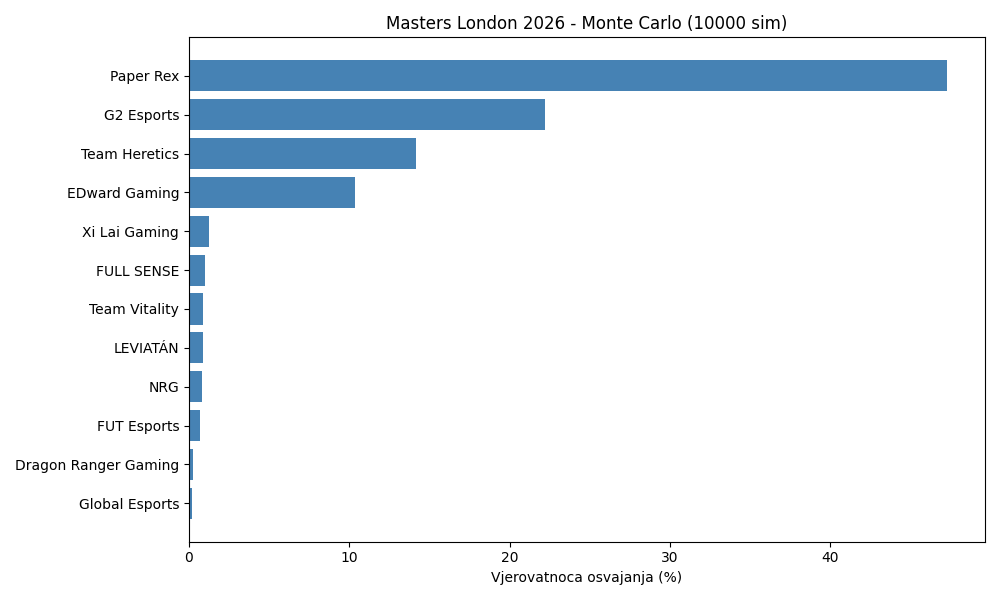

---

## 14. Analiza mete agenata

Nezavisno od modela predikcije, `kod/agenti.py` analizira pick rate i win
rate agenata kroz sezone 2021–2026 (9 grafova):

| Graf | Sadržaj |
|---|---|
| 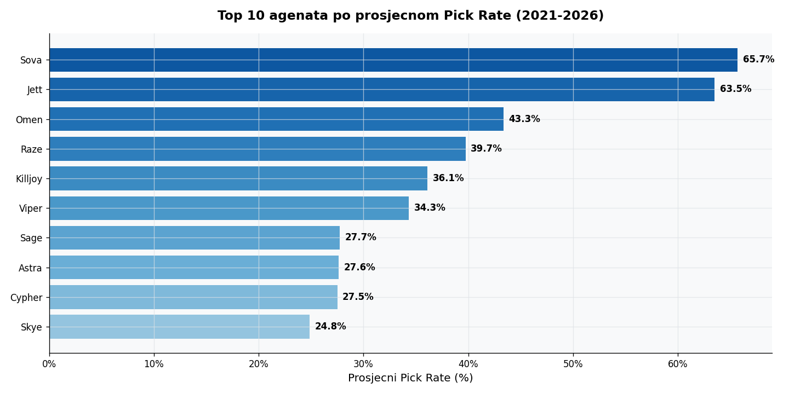 | Top 10 agenata po prosječnom pick rate-u |
| 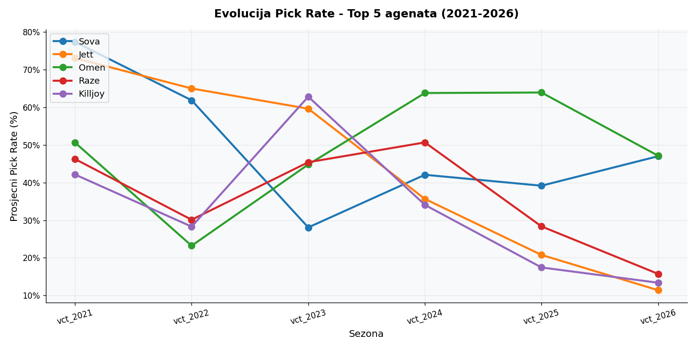 | Evolucija pick rate-a top 5 agenata kroz godine |
| 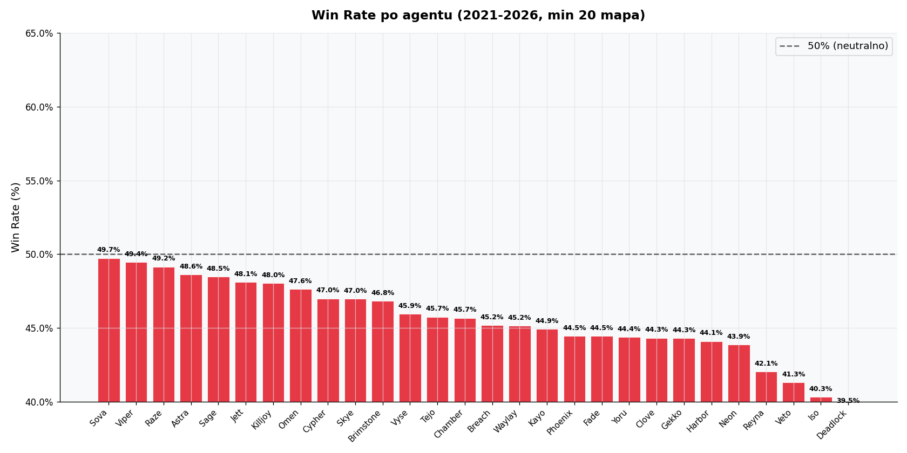 | Win rate po agentu (min. 20 mapa) |
| 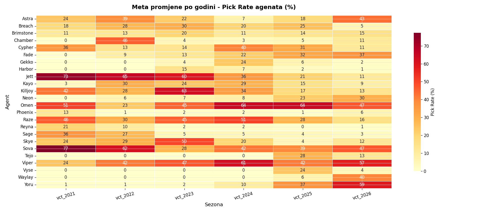 | Meta promjene po godini (heatmapa) |
| 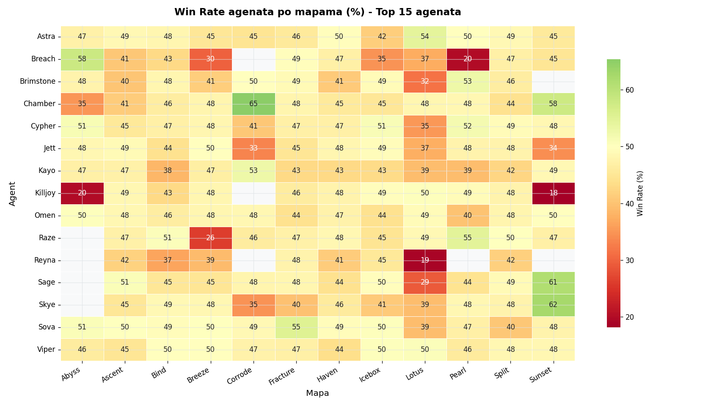 | Win rate agenata po mapama |
| 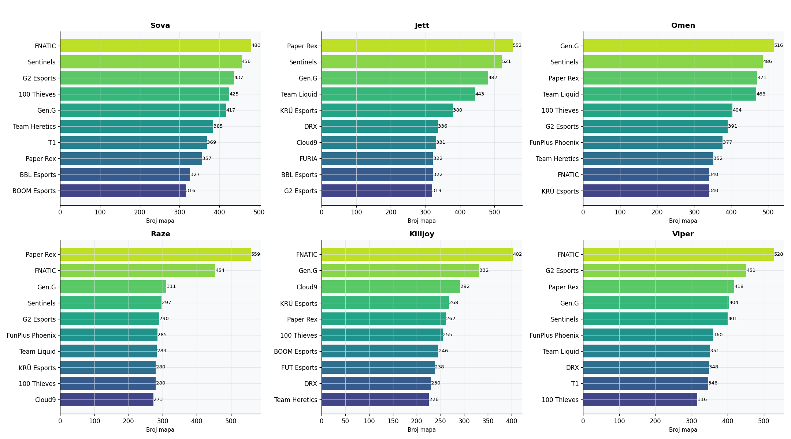 | Top timovi po agentu |
| 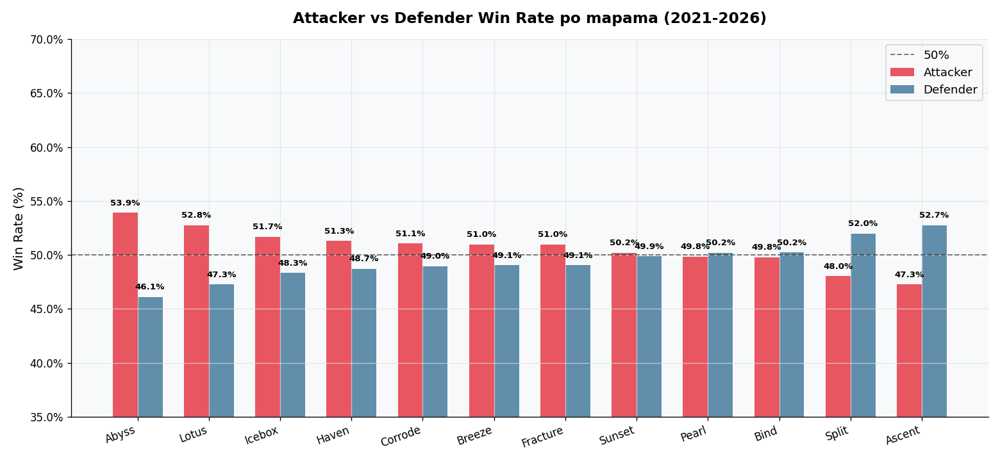 | Attacker vs Defender win rate po mapama |
| 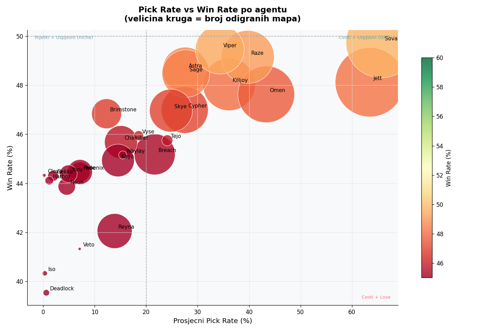 | Pick rate vs win rate (koji agenti su OP?) |
| 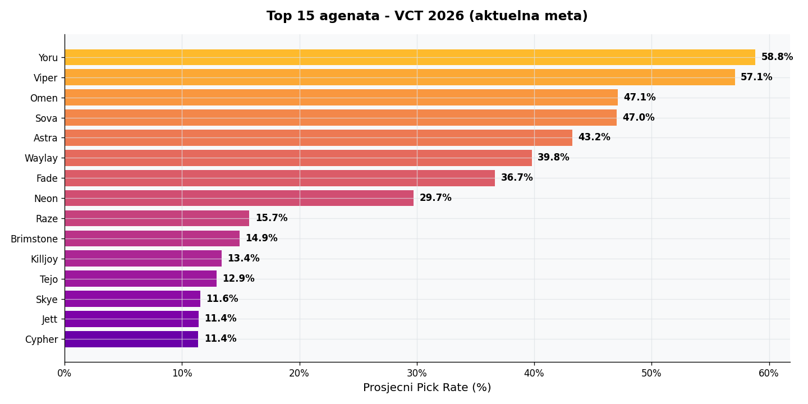 | Top 15 agenata — VCT 2026 aktuelna meta |

---

## 15. Identifikovani problemi i rješenja

### 15.1 Bug: Alias timova (NRG = Mega Minors u datasetu)

**Problem:** Kaggle dataset sadrži NRG-ove mečeve pod imenom "Mega Minors"
za period 2025–2026. Bez kanonizacije, model je mislio da NRG ima samo 9
mečeva iskustva.
**Rješenje:** `ALIAS_MAPPING` primijenjen na sve dataframe-ove prije feature
engineeringa.

### 15.2 Bug: `win_rate_a/b` u CSV-u računat prije kanonizacije

**Problem:** Predračunati `win_rate` u `dataset_sa_featurima.csv` ne uzima u
obzir alias merge — NRG je imao samo 9 mečeva i win_rate 0.778 (samo Stage
1 2026), dok Xi Lai ima 42 meča, što je davalo lažno visoku predikciju (Xi
Lai 71% protiv NRG-a).
**Rješenje:** `racunaj_dinamicki_wr()` računa win rate i broj mečeva
**dinamički** nakon kanonizacije.

### 15.3 Bug: Eco feature uvijek 0.5 (pogrešni nazivi kategorija)

**Problem:** Kod je tražio kategorije `"$ (Eco)"` i `"$$$ (Full Buy)"`, ali
stvarni nazivi u CSV-u su `"Eco (won)"`, `"$$$ (won)"`, `"Pistol Won"` itd.
**Rješenje:** Ispravljeni nazivi kategorija, dodana posebna obrada za
pistol runde (`Initiated` kolona nije popunjena za pistol, ali je uvijek 2
po mapi).

### 15.4 Bug: Data leakage u cross-validaciji

**Problem:** K-fold CV se prvobitno vršio na cijelom datasetu (train +
test), što je davalo lažno optimistične CV rezultate.
**Rješenje:** CV se vrši isključivo na trening setu. Naknadno dodatno
poboljšano sa `TimeSeriesSplit` umjesto običnog k-fold-a ([§8.1](#81-timeseriessplit-umjesto-k-fold-a)).

### 15.5 Bug: Swiss Round 1 parovi generisani sortiranjem

**Problem:** Generalizovana funkcija je kreirala Swiss parove sortiranjem
liste timova, što je davalo pogrešne Round 1 parove (ne odgovaraju
stvarnom drawu).
**Rješenje:** `STVARNI_R1_PAROVI` hardkodirani na osnovu stvarnog drawa sa
vlr.gg. Round 2+ se generišu dinamički (1-0 vs 1-0, 0-1 vs 0-1), pošto ti
parovi *zavise* od ishoda Round 1 i ne mogu biti unaprijed poznati.

### 15.6 AI-generisani Stage 1 podaci

**Problem:** Folder `vct_2026/stage 1/` sadrži podatke djelimično kreirane
uz pomoć AI, ne direktno preuzete sa Kaggle-a.
**Zaključak:** Standings (plasmani i championship points) i playoff
rezultati su ručno provjereni i potvrđeni kao tačni za sva 4 regiona. Dio
Group Stage mečeva ima manje greške u parovima, ali pošto se kao feature
koriste samo standings (koji su tačni), podaci su zadržani.

### 15.7 Bug: GridSearchCV nije primao recency weighting za LR/SVM

**Problem:** Pri podešavanju hiperparametara, `lr_grid.fit()` i
`svm_grid.fit()` nisu primali `sample_weight` (potreban je `clf__`
prefiks pošto su upakovani u `Pipeline`) — tuned verzije ovih modela su
ignorisale recency weighting iako ga je default verzija poštovala.
**Rješenje:** Dodat `clf__sample_weight=sample_weights` u oba poziva.

### 15.8 Bug: `GridSearchCV.score()` vraća scoring metriku, ne accuracy

**Problem:** Nakon prebacivanja `GridSearchCV` scoring-a na
`"neg_brier_score"` ([§8.2](#82-gridsearchcv-scoring--neg_brier_score-ne-accuracy)),
pozivi `grid.score(X_test, y_test)` su počeli vraćati negativni Brier
score umjesto accuracy-ja (jer `GridSearchCV.score()` koristi isti scorer
zadat u konstruktoru) — ovo je tiho pokvarilo logiku poređenja "default vs
tuned" model (negativni brojevi nikad ne prelaze accuracy, pa se tuned
model nikad nije birao).
**Rješenje:** Dodata `_test_accuracy()` pomoćna funkcija koja računa
accuracy eksplicitno preko `predict()`, nezavisno od scoring-a.

### 15.9 Bug: Grafovi su prikazivali pogrešan (pred-tuning) model

**Problem:** `plot_confusion_matrix()` i `plot_feature_importance()` su se
pozivali **prije** `tune_hyperparameters()`, koristeći default-best model
(po accuracy-ju), ne finalni tuned model koji se stvarno exportuje i
koristi u web app-u.
**Rješenje:** Pozivi pomjereni nakon `tune_hyperparameters()` u `main.py`.

### 15.10 Crash: matplotlib Tkinter konflikt

**Problem:** Default matplotlib backend (TkAgg) je izazivao
`RuntimeError: main thread is not in main loop` koji je rušio `main.py`
bez ijednog ispisa, u određenim kontekstima izvršavanja.
**Rješenje:** Forsiran neinteraktivni `Agg` backend (`matplotlib.use("Agg")`)
u svim modulima koji crtaju grafove — skripta nikad ne prikazuje prozore,
samo čuva fajlove (`savefig`).

### 15.11 Case-insensitive duplikati timova

**Problem:** Isti tim se pojavljuje pod dva imena koja se razlikuju samo po
velikim/malim slovima (npr. `"Aqua"`/`"aqua"`) zbog različitih scraping
izvora — razvodnjava statistike (ELO, win rate) za oba zapisa, isti tip
problema kao NRG/Mega Minors prije ručne kanonizacije.
**Rješenje:** `izgradi_case_insensitive_mapping()` automatski detektuje i
spaja ovakve parove (34 detektovano), izvor je unija imena iz svih
učitanih fajlova.

---

## 16. Struktura koda

Pipeline za predikciju mečeva (nekad jedan `london.py` fajl od ~1400
linija) je podijeljen po fazama:

```
kod/
  config.py             - putanje, konstante, lista timova/parova za Masters London 2026
  data_loading.py        - ucitavanje CSV-ova i kanonizacija (alias + case-insensitive)
  features.py             - feature engineering po timu (ELO, forma, eco stats...)
  dataset_prep.py          - spajanje featura sa mecevima, diff-feature, train/test split
  eda.py                    - korelaciona analiza i detekcija anomalija
  models.py                  - treniranje, CV (TimeSeriesSplit), GridSearchCV (neg_brier_score)
  feature_selection.py        - SelectKBest, RFE, RF importance
  predict.py                   - MatchPredictor klasa (picklable, za deployment)
  simulate.py                   - Swiss + double-elimination, Monte Carlo
  main.py                        - pokrece cijeli pipeline od pocetka do kraja
  agenti.py                      - nezavisna analiza agenata (9 grafova)
  app.py                          - Streamlit UI za koriscenje istreniranog modela
```

---

## 17. Pokretanje projekta

Vidi [README.md](README.md) za kompletno uputstvo (kloniranje, preuzimanje
dataseta, instalacija). Skraćeno:

```bash
pip install -r requirements.txt

python kod/main.py              # trening + export modela
python kod/agenti.py            # analiza agenata (nezavisno)
streamlit run kod/app.py        # web UI za predikciju
```

---

## 18. Naredne faze projekta

### 18.1 Stage 2 regionalna takmičenja (jul–avgust 2026)

Isti model će biti primijenjen za predviđanje Stage 2 rezultata:
- Championship Points će biti ažurirani sa Masters London rezultatima
- Stage 1 standings se zamjenjuju Stage 2 standings
- Cilj: predviđanje koja 3 tima iz svakog regiona će se kvalifikovati za Champions Shanghai

### 18.2 Champions Shanghai 2026 (septembar–oktobar 2026)

Finalna faza projekta — predviđanje svjetskog prvaka:
- Skup učesnika: top 3 tima iz svakog regiona (12 timova) + eventualni wildcard
- Format: Swiss Stage + Double Elimination
- Evaluacija: predikcije će se uporediti sa stvarnim rezultatima

---

## 19. Zaključak

Razvijen je sistem za predviđanje ishoda Valorant profesionalnih mečeva koji:

- Obrađuje preko 4300 mečeva iz perioda 2021–2026, sa 35 inženjerisanih atributa
- Trenira i poredi 5 algoritama (Logistička regresija, KNN, Random Forest,
  SVM, Gradient Boosting) plus soft-voting ensemble, sa vremenski svjesnom
  validacijom (`TimeSeriesSplit`) i podešavanjem hiperparametara po
  kalibraciji vjerovatnoća (`neg_brier_score`), ne samo accuracy-ju
- Postiže accuracy ~64% i ROC-AUC ~0.70 na test setu (2025–2026) —
  statistički značajno bolje od slučajnog (50%), u skladu sa očekivanjima
  za predikciju sportskih ishoda
- Bira finalni model po kalibraciji vjerovatnoća (Random Forest), pošto se
  `predict_proba()` direktno koristi u Monte Carlo simulaciji — eksplicitno
  testirano i potvrđeno kalibracionom krivom
- Identifikuje najznačajnije atribute kroz tri nezavisne metode (SelectKBest,
  RFE, RF importance) — dinamički win rate i ELO razlika dominiraju
- Simulira kompletan turnir deterministički i Monte Carlo metodom (10.000
  simulacija), sa stvarnim Swiss draw parovima
- Je deployovan kroz `MatchPredictor` (picklable objekat) i Streamlit web
  aplikaciju, sa filtriranjem podataka niskog kvaliteta (amaterski timovi)
  i indikatorom pouzdanosti predikcije u UI-ju

Ključni doprinos projekta je identifikacija i rješavanje **11 konkretnih
problema** ([§15](#15-identifikovani-problemi-i-rješenja)) kroz iterativni
proces razvoja i provjere — od kanonizacije imena timova, preko data
leakage u validaciji, do kalibracije vjerovatnoća korištenih u simulaciji —
što je značajno poboljšalo realnost i pouzdanost predikcija u odnosu na
prvu, naivnu implementaciju.
